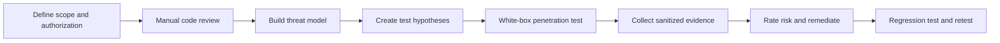
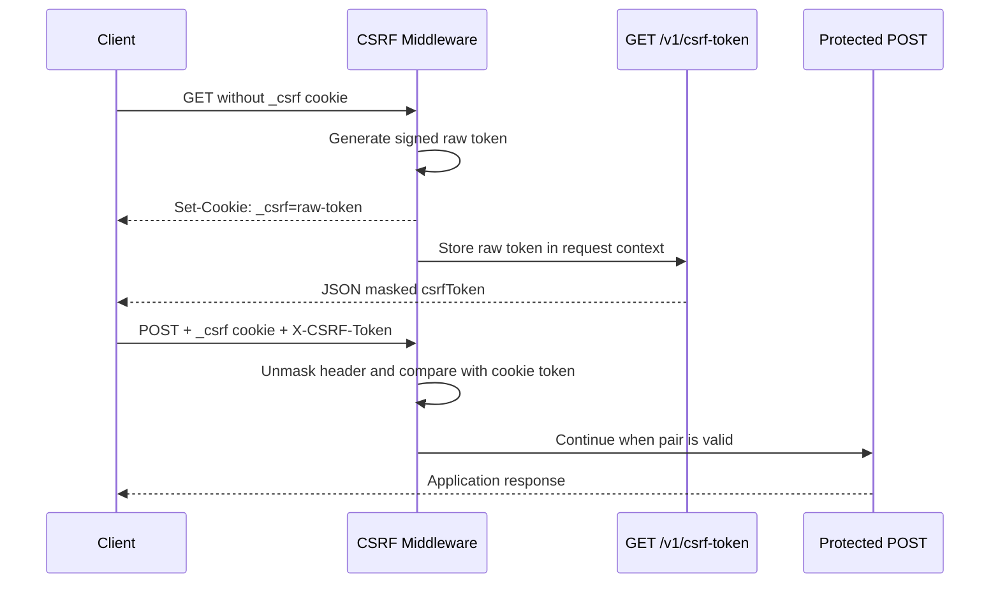

# Manual Security Code Review, Threat Modeling, and White-Box Penetration Testing

## Document Information

| Field | Value |
|---|---|
| Project | Lihatin / Lihat.in |
| Backend | `Lihatin-Go` |
| Frontend | `lihatin-ui` |
| Assessment type | Manual security code review, threat modeling, and white-box penetration testing |
| Primary focus | Authentication cookies, CSRF, CORS, authorization, and state-changing API requests |
| Test environment | Local or dedicated staging only |
| Production testing | Not permitted unless separately authorized |
| Document status | Working security assessment plan |

## 1. Purpose

Dokumen ini menjadi panduan untuk melakukan tiga tahap pemeriksaan keamanan:

1. **Manual security code review** untuk menemukan kelemahan dari source code dan konfigurasi.
2. **Threat modeling** untuk memetakan aset, trust boundary, attacker, dan skenario penyalahgunaan.
3. **White-box penetration testing** untuk memvalidasi temuan melalui request nyata pada environment yang diizinkan.

Tujuan akhirnya bukan hanya menemukan bug, tetapi menghasilkan bukti yang dapat direproduksi, menilai dampak, memperbaiki akar masalah, dan menambahkan regression test.

## 2. Authorization and Rules of Engagement

Pengujian hanya boleh dilakukan terhadap sistem yang dimiliki atau secara eksplisit diizinkan oleh pemiliknya.

### Allowed

- Membaca source code, konfigurasi, route, middleware, dan test.
- Menjalankan backend dan frontend secara lokal atau di staging khusus.
- Mengirim request manual dengan browser DevTools, PowerShell, curl, Postman, atau Burp Suite.
- Menggunakan akun uji dengan role user, admin, dan super admin.
- Memvalidasi authentication, authorization, CSRF, CORS, session, dan input validation.
- Menyimpan bukti berupa request/response yang sudah disanitasi.
- Menyerang production.
- Mengakses data pengguna nyata.
- Melakukan denial of service, stress test, atau brute force tidak terbatas.
- Menghapus atau merusak data.
- Mengirim email, OTP, webhook, atau notifikasi ke pihak nyata.
- Mengeksfiltrasi token, cookie, password, atau data sensitif.

### Not allowed without additional authorization

- Menguji domain, IP, atau layanan pihak ketiga di luar scope.

### Safety controls

- Gunakan database seed khusus testing.
- Gunakan alamat email sink atau mail sandbox.
- Batasi request rate dan concurrency.
- Gunakan token dan cookie dummy.
- Hapus secret dari screenshot, log, dan laporan.
- Catat waktu mulai, waktu selesai, tester, target, dan perubahan environment.

## 3. Scope

### In scope

- `Lihatin-Go/internal/pkg/csrf`
- `Lihatin-Go/internal/pkg/auth`
- `Lihatin-Go/middleware`
- `Lihatin-Go/routes`
- Endpoint `/v1/csrf-token`
- Endpoint authenticated yang melakukan `POST`, `PUT`, `PATCH`, dan `DELETE`
- Cookie `_csrf`, `access_token`, dan `refresh_token`
- Frontend request wrapper pada `lihatin-ui/lib/api/fetch-wrapper.ts`
- Konfigurasi `ALLOWED_ORIGINS`, `DOMAIN`, `ENV`, dan `CSRF_SECRET`

### Initially out of scope

- Infrastruktur cloud di luar konfigurasi repository.
- Database server dan Redis/Valkey yang tidak disediakan khusus untuk testing.
- Dependency supply-chain assessment mendalam.
- Load testing dan availability testing.

## 4. Assessment Methodology



### Phase 1 — Manual security code review

1. Petakan route publik dan protected.
2. Catat urutan middleware global dan route-specific.
3. Telusuri sumber authentication dan authorization.
4. Periksa pembuatan, penyimpanan, rotasi, dan penghapusan cookie.
5. Periksa validasi CSRF untuk seluruh unsafe method.
6. Periksa CORS dan trusted origin.
7. Periksa error handling agar tidak membocorkan detail sensitif.
8. Periksa konfigurasi production dan fallback yang tidak aman.
9. Periksa apakah frontend selalu membawa cookie dan CSRF header.
10. Tandai setiap temuan sebagai **confirmed by code**, **requires runtime validation**, atau **not reproducible**.

### Phase 2 — Threat modeling

Gunakan pendekatan asset, actor, entry point, trust boundary, dan abuse case. STRIDE dapat digunakan sebagai checklist tambahan:

| Category | Pertanyaan utama |
|---|---|
| Spoofing | Bisakah attacker menyamar sebagai user atau admin? |
| Tampering | Bisakah request, cookie, atau parameter dimodifikasi tanpa terdeteksi? |
| Repudiation | Apakah aksi sensitif memiliki audit trail yang cukup? |
| Information disclosure | Bisakah response, CORS, log, atau error membocorkan data? |
| Denial of service | Bisakah endpoint mahal dipanggil tanpa pembatasan? |
| Elevation of privilege | Bisakah user biasa mencapai fungsi admin? |

### Phase 3 — White-box penetration testing

1. Ubah setiap threat scenario menjadi test case.
2. Tentukan precondition dan expected secure behavior.
3. Jalankan request pada local/staging.
4. Simpan request, response, status code, cookie attributes, dan server log yang relevan.
5. Hindari menganggap anomali sebagai vulnerability sebelum dampaknya terbukti.
6. Setelah diperbaiki, jalankan ulang test case yang sama.

## 5. System Security Model

### Protected assets

- Account dan authenticated session.
- Cookie `access_token` dan `refresh_token`.
- CSRF cookie dan CSRF response token.
- Data short link, analytics, user profile, premium code, support ticket, dan admin data.
- Role dan authorization boundary antara user, admin, dan super admin.
- API key dan support access token.

### Attacker profiles

| Actor | Capability |
|---|---|
| Unauthenticated remote attacker | Dapat mengirim request tanpa session |
| Authenticated low-privilege user | Memiliki akun user biasa dan session valid |
| Malicious website | Dapat membuat browser korban mengirim cross-site request |
| Compromised allowed origin | Dapat menjalankan JavaScript dari origin yang dipercaya |
| API client | Dapat mengatur header, cookie jar, Origin, dan Referer secara manual |
| Insider/tester with source access | Mengetahui route dan implementasi, tetapi tidak boleh mengetahui production secret |

### Trust boundaries

- Browser ↔ frontend Next.js.
- Frontend origin ↔ backend API origin.
- Backend ↔ database.
- Backend ↔ Redis/Valkey session storage.
- Public route ↔ authenticated route.
- User route ↔ admin route.

## 6. CSRF Flow Analysis

Current implementation menggunakan pola cookie-bound token:



### Expected behavior

| Scenario | Expected result |
|---|---|
| GET token without an existing `_csrf` cookie | `200`; new cookie and masked token are issued |
| POST with header token but without matching `_csrf` cookie | `403` |
| POST with cookie but without header token | `403` |
| POST with mismatched cookie/header pair | `403` |
| POST with valid CSRF pair but without authentication | CSRF passes, then protected route returns `401` |
| POST with valid CSRF pair and valid authentication | Request reaches controller |
| Public endpoint listed in `SkipRules` | Behavior follows route-specific authentication and validation |

CSRF bukan authentication. Client mana pun boleh memperoleh pasangan CSRF miliknya sendiri. Perlindungan CSRF bertujuan mencegah website lain menggunakan ambient authenticated cookie milik korban tanpa mengetahui token pasangan yang benar.

## 7. Initial Findings from Manual Review

Temuan berikut berasal dari pembacaan source code. Temuan yang ditandai *runtime validation required* harus dibuktikan di local/staging sebelum diperlakukan sebagai vulnerability terkonfirmasi.

### SEC-001 — Development localhost CORS fallback is not environment-gated

**Initial severity:** High  
**Status:** Confirmed by code; runtime impact validation required

`CORSMiddleware` menerima origin yang mengandung substring `localhost` atau `127.0.0.1`. Pemeriksaan tersebut tidak dibatasi hanya ketika `ENV=development`.

Potentially malicious examples:

- `https://evil-localhost.example`
- `https://localhost.attacker.example`
- `https://127.0.0.1.attacker.example`

Jika browser menerima `Access-Control-Allow-Origin` untuk origin tersebut bersama `Access-Control-Allow-Credentials: true`, authenticated GET response berpotensi dapat dibaca oleh origin yang tidak dipercaya. Dampak aktual bergantung pada cookie attributes, domain, browser behavior, dan deployment configuration.

**Recommendation:**

- Parse origin menggunakan `net/url`.
- Bandingkan hostname secara exact.
- Aktifkan localhost fallback hanya pada development.
- Jangan mengirim `Access-Control-Allow-Credentials: true` kepada origin yang tidak secara eksplisit diizinkan.
- Tambahkan `Vary: Origin`.

### SEC-002 — SameSite is configured after the CSRF cookie is written

**Initial severity:** Medium  
**Status:** Confirmed by code

Pada `getOrCreateToken`, `c.SetCookie(...)` dipanggil sebelum `c.SetSameSite(opts.SameSite)`. Gin membaca nilai SameSite ketika `SetCookie` dieksekusi, sehingga urutan sekarang tidak menjamin atribut yang diinginkan masuk ke header `Set-Cookie`.

**Recommendation:**

Panggil `c.SetSameSite(opts.SameSite)` sebelum `c.SetCookie(...)`, atau gunakan `SetCookieData` dengan `SameSite` eksplisit.

### SEC-003 — CSRF token is accepted through a query parameter

**Initial severity:** Low to Medium  
**Status:** Confirmed by code

`getTokenFromRequest` menerima token dari header, form field, dan query parameter. Token pada URL dapat masuk ke access log, proxy log, browser history, monitoring, atau diagnostic output.

**Recommendation:**

Untuk JSON API, terima token hanya melalui `X-CSRF-Token`. Pertahankan form field hanya jika server-rendered form memang digunakan. Hapus query parameter fallback.

### SEC-004 — Random CSRF secret fallback in production

**Initial severity:** Medium operational risk  
**Status:** Confirmed by code

Jika `CSRF_SECRET` kosong, aplikasi membuat secret acak saat startup. Pada restart atau multi-instance deployment, token yang diterbitkan instance lain dapat menjadi invalid.

**Recommendation:**

- Jadikan `CSRF_SECRET` required ketika `ENV=production`.
- Gunakan secret yang konsisten, random, dan minimal 32 byte.
- Rotasi secret melalui prosedur terkontrol.

### SEC-005 — Frontend logs part of the masked CSRF token

**Initial severity:** Informational  
**Status:** Confirmed by code

Request wrapper mencetak sebagian masked token ke console. Masked token tidak sama dengan raw cookie token, tetapi logging token tidak dibutuhkan pada production.

**Recommendation:**

Hapus log token atau batasi log hanya pada explicit debug mode.

### SEC-006 — CSRF middleware is disabled outside production

**Initial severity:** Informational / testing gap  
**Status:** Confirmed by code

Local testing dengan default `ENV=development` tidak memvalidasi behavior CSRF production.

**Recommendation:**

Sediakan profile local security testing yang mengaktifkan CSRF dengan HTTPS atau localhost exception yang terkontrol.

## 8. White-Box Test Environment Preparation

### Required environment

- Backend dan frontend berjalan pada local atau staging terisolasi.
- Gunakan konfigurasi semirip mungkin dengan production.
- `CSRF_SECRET` diisi dengan test secret minimal 32 byte.
- `ALLOWED_ORIGINS` hanya berisi frontend test origin.
- Gunakan HTTPS di staging jika production menggunakan HTTPS.
- Database menggunakan seed data disposable.
- Siapkan akun user, admin, dan super admin khusus test.

### Evidence directory

Simpan bukti di lokasi yang tidak ikut ter-commit, misalnya:

```text
security-evidence/
  YYYY-MM-DD/
    requests/
    responses/
    screenshots/
    server-logs/
    notes.md
```

Tambahkan direktori tersebut ke `.gitignore` jika mengandung token atau data uji sensitif.

## 9. CSRF White-Box Test Cases

### CSRF-001 — Initial token bootstrap without cookie

**Goal:** Memastikan client baru memperoleh cookie dan masked token.

1. Bersihkan cookie jar.
2. Kirim `GET /v1/csrf-token`.
3. Periksa status, JSON body, dan `Set-Cookie`.

**Expected:**

- Status `200`.
- Response berisi `data.csrfToken`.
- Header menetapkan cookie `_csrf` dengan `HttpOnly`, `Secure` pada HTTPS, path yang benar, dan SameSite yang diharapkan.

### CSRF-002 — Header token without cookie

**Goal:** Memastikan token JSON tidak dapat digunakan tanpa cookie pasangannya.

1. Ambil masked token.
2. Buang cookie jar.
3. Kirim protected POST dengan `X-CSRF-Token` tetapi tanpa `_csrf` cookie.

**Expected:** `403 CSRF validation failed`.

### CSRF-003 — Cookie without request token

**Goal:** Memastikan ambient cookie saja tidak cukup.

1. Ambil CSRF cookie.
2. Kirim protected POST tanpa `X-CSRF-Token`.

**Expected:** `403 CSRF validation failed`.

### CSRF-004 — Mismatched pairs

**Goal:** Memastikan token dari client A tidak dapat dipasangkan dengan cookie client B.

1. Buat cookie jar A dan B.
2. Ambil token masing-masing.
3. Kirim token A bersama cookie B.

**Expected:** `403`.

### CSRF-005 — Valid CSRF pair without authentication

**Goal:** Membuktikan bahwa CSRF bukan pengganti authentication.

1. Ambil CSRF pair yang valid.
2. Kirim request ke protected endpoint tanpa `access_token` atau Bearer token.

**Expected:** Lolos CSRF lalu mendapat `401 Authorization required`.

### CSRF-006 — Valid CSRF pair with authenticated session

**Goal:** Memastikan legitimate state-changing request berfungsi.

1. Login menggunakan test account.
2. Ambil atau refresh CSRF token dengan cookie jar yang sama.
3. Kirim harmless state-changing request yang dapat dibatalkan.

**Expected:** Request diproses sesuai authorization dan business validation.

### CSRF-007 — Expired token

**Goal:** Memastikan token melewati expiry sesuai `MaxAge`.

Gunakan test-only configuration dengan MaxAge pendek. Jangan menunggu 12 jam pada production-like environment.

**Expected:** Token lama ditolak; client dapat mengambil pasangan baru dan retry satu kali.

### CSRF-008 — Origin and Referer validation

Uji minimal:

- Allowed exact origin.
- Untrusted origin.
- Origin dengan suffix/prefix menipu.
- Missing Origin pada HTTPS dengan valid Referer.
- Missing Origin dan missing Referer pada HTTPS.
- HTTP local behavior.

### CSRF-009 — Skip rule boundary

**Goal:** Memastikan bypass hanya berlaku pada method dan exact route pattern yang ditentukan.

Uji:

- Method berbeda pada path yang sama.
- Path dengan suffix tambahan.
- Encoded path.
- Duplicate slash atau normalization edge case.
- Dynamic support ticket route.

### CSRF-010 — Cookie attribute verification

Periksa raw `Set-Cookie` dan pastikan:

- `HttpOnly` aktif.
- `Secure` aktif pada HTTPS.
- `SameSite` eksplisit.
- `Domain` sesuai deployment.
- `Path=/` jika memang diperlukan oleh semua API route.
- Tidak ada duplicate `_csrf` cookie dengan Domain/Path berbeda.

## 10. CORS White-Box Test Cases

### CORS-001 — Exact allowed origin

**Expected:** Response mencantumkan origin yang benar, credentials, allowed headers, dan `Vary: Origin`.

### CORS-002 — Completely unrelated origin

**Expected:** Tidak ada `Access-Control-Allow-Origin`.

### CORS-003 — Origin containing localhost substring

Test examples:

```text
https://evil-localhost.example
https://localhost.attacker.example
https://127.0.0.1.attacker.example
```

**Expected secure behavior:** Tidak ada `Access-Control-Allow-Origin` pada staging/production.

### CORS-004 — Credentialed authenticated GET

Gunakan endpoint read-only dengan akun seed. Validasi apakah origin yang tidak dipercaya dapat membaca response ketika browser membawa authentication cookie.

**Expected:** Browser memblokir pembacaan response dan backend tidak mengizinkan origin tersebut.

### CORS-005 — Preflight for CSRF header

Kirim OPTIONS dengan `Access-Control-Request-Headers: X-CSRF-Token, Content-Type`.

**Expected:** Hanya trusted origin yang menerima CORS allow response.

## 11. Authentication and Authorization Test Cases

### AUTHN-001 — Protected request without credentials

**Expected:** `401`, bukan `403` authorization dan bukan `500`.

### AUTHN-002 — Invalid, expired, and revoked access token

**Expected:** Semua ditolak dan tidak membuat session baru secara diam-diam.

### AUTHN-003 — Refresh token cookie behavior

Validasi Path, Domain, Secure, HttpOnly, SameSite, rotation, replay handling, dan invalidation saat logout.

### AUTHZ-001 — User attempts admin endpoint

Gunakan user session valid terhadap seluruh route admin.

**Expected:** `403` dan tidak ada data admin yang bocor.

### AUTHZ-002 — Object-level authorization

User A mencoba membaca atau mengubah resource milik User B dengan mengganti ID, code, atau path parameter.

**Expected:** `403` atau `404` tanpa data leakage.

### AUTHZ-003 — Role transition and stale session

Turunkan role admin menjadi user saat session masih aktif, lalu ulangi admin request.

**Expected:** Authorization menggunakan state terbaru atau session di-revoke sesuai desain.

## 12. Reproducible PowerShell CSRF Harness

Gunakan hanya pada local/staging yang diizinkan.

```powershell
$api = "http://localhost:8080/v1"
$origin = "http://localhost:3000"
$session = New-Object Microsoft.PowerShell.Commands.WebRequestSession

# Bootstrap CSRF pair. The session stores the _csrf cookie.
$csrfResponse = Invoke-RestMethod `
  -Uri "$api/csrf-token" `
  -Method Get `
  -WebSession $session `
  -Headers @{ Origin = $origin }

$csrfToken = $csrfResponse.data.csrfToken

# Replace with a harmless endpoint and disposable payload.
$response = Invoke-WebRequest `
  -Uri "$api/target-endpoint" `
  -Method Post `
  -WebSession $session `
  -Headers @{
    Origin = $origin
    "X-CSRF-Token" = $csrfToken
  } `
  -ContentType "application/json" `
  -Body '{"test":true}' `
  -SkipHttpErrorCheck

$response.StatusCode
$response.Content
```

Untuk negative test tanpa cookie, buat request POST menggunakan WebRequestSession baru. Jangan menyalin authentication cookie production ke script.

## 13. Finding Validation Standard

Sebuah temuan dinyatakan confirmed jika memiliki:

- Affected component dan route.
- Preconditions yang jelas.
- Reproduction steps yang dapat diulang.
- Expected versus actual behavior.
- Sanitized request dan response.
- Dampak terhadap confidentiality, integrity, atau availability.
- Penjelasan mengapa existing security control tidak mencegah dampak.
- Suggested remediation.
- Regression test.

## 14. Risk Rating

| Severity | General guideline |
|---|---|
| Critical | Account/system compromise dengan prasyarat minimal atau dampak massal |
| High | Authentication/authorization bypass atau sensitive data exposure yang signifikan |
| Medium | Eksploitasi memerlukan kondisi tambahan atau dampak terbatas |
| Low | Dampak kecil, defense-in-depth, atau informasi terbatas |
| Informational | Tidak langsung exploitable tetapi meningkatkan security posture |

Nilai final harus mempertimbangkan exploitability, privileges required, user interaction, deployment configuration, dan data impact. Jangan menentukan severity hanya dari nama kelemahan.

## 15. Finding Template

```markdown
### SEC-XXX — Finding title

**Severity:** High / Medium / Low / Informational
**Status:** Hypothesis / Confirmed / Fixed / Retested
**Affected component:**
**Affected route:**

#### Summary

#### Preconditions

#### Reproduction steps

#### Expected behavior

#### Actual behavior

#### Security impact

#### Evidence

#### Root cause

#### Recommendation

#### Regression test
```

## 16. Remediation Priorities

1. Perketat CORS origin matching dan hapus production localhost fallback.
2. Perbaiki urutan penerapan SameSite pada CSRF cookie.
3. Wajibkan stable `CSRF_SECRET` di production.
4. Hapus CSRF token dari query parameter.
5. Hapus token logging dari frontend production.
6. Tambahkan automated CSRF/CORS integration test.
7. Jalankan seluruh authorization matrix untuk user, admin, dan super admin.
8. Retest menggunakan browser sungguhan untuk behavior cookie dan CORS.

## 17. Regression Test Checklist

- [ ] GET `/v1/csrf-token` menghasilkan cookie dan masked token.
- [ ] Header tanpa cookie ditolak.
- [ ] Cookie tanpa header ditolak.
- [ ] Mismatched pair ditolak.
- [ ] Token expired ditolak.
- [ ] SameSite muncul pada raw `Set-Cookie`.
- [ ] Untrusted CORS origin tidak menerima allow-origin.
- [ ] Localhost substring bypass tidak berhasil.
- [ ] Public skip rule tidak berlaku pada route/method lain.
- [ ] Protected route tetap membutuhkan authentication.
- [ ] User biasa tidak dapat mengakses admin route.
- [ ] CSRF retry frontend hanya dilakukan satu kali.
- [ ] Tidak ada token yang dicetak ke production console/log.
- [ ] Restart dan multi-instance tidak menginvalidasi token karena secret berbeda.

## 18. Completion Criteria

Assessment dianggap selesai jika:

- Seluruh in-scope route sudah dipetakan.
- Threat scenario utama memiliki test case.
- Semua test case memiliki hasil dan bukti.
- Temuan sudah diberi severity dan owner.
- High dan Critical finding sudah diperbaiki atau menerima documented risk acceptance.
- Fix sudah melalui regression test dan retest.
- Evidence sensitif sudah disanitasi atau dihapus.
- Final report membedakan confirmed vulnerability, configuration risk, dan informational observation.

